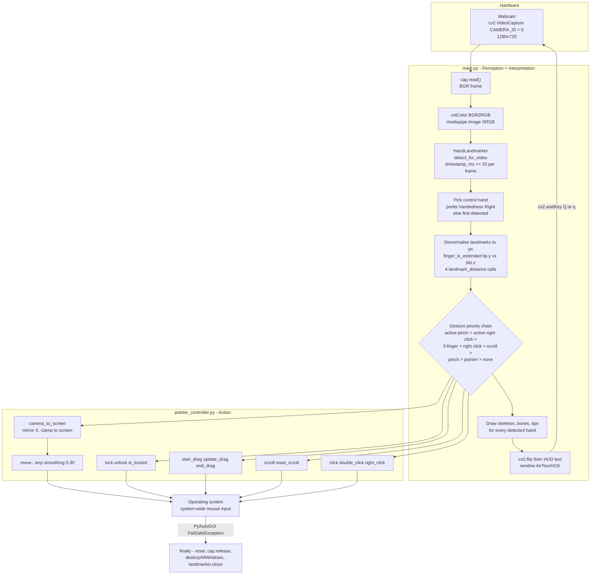
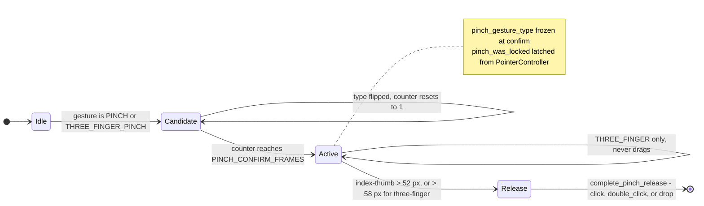

# AirTouchOS — Touchless OS Controller

Control your computer's mouse with hand gestures in front of a webcam. No touchscreen, no hand-held device, no hardware beyond a camera.

[](https://www.python.org/)
[](https://ai.google.dev/edge/mediapipe)
[](https://opencv.org/)
[](https://pyautogui.readthedocs.io/)
[](https://numpy.org/)
[](https://learn.microsoft.com/en-us/windows/)
[](https://opensource.org/licenses)
[](https://docs.pytest.org/)

---

## Table of Contents

- [Overview](#overview)
- [Features](#features)
- [Gesture Reference](#gesture-reference)
- [Architecture](#architecture)
- [Gesture State Machine](#gesture-state-machine)
- [Tech Stack](#tech-stack)
- [Project Structure](#project-structure)
- [Setup Guide](#setup-guide)
- [Execution Guide](#execution-guide)
- [PointerController API](#pointercontroller-api)
- [Configuration](#configuration)
- [Troubleshooting](#troubleshooting)
- [Limitations and Unverified Claims](#limitations-and-unverified-claims)
- [Contributing](#contributing)
- [License](#license)

---

## Overview

AirTouchOS is a single-purpose desktop automation tool. It reads a webcam feed, tracks hands with MediaPipe's `HandLandmarker`, classifies finger poses into discrete gestures using a hand-rolled priority state machine, and translates them into real operating-system mouse input via PyAutoGUI. Because the input is injected at the OS level, clicks, drags, and scrolling work in any application — browser, file explorer, editor, or native desktop app — without that application knowing anything about AirTouchOS. A live mirrored preview window shows the tracked skeleton, the currently recognised gesture, and state indicators (cursor lock, drag, right-click, hold countdown) so you can see what the system thinks your hand is doing.

Everything runs locally. There is no web server, no database, no network call, and no configuration file.

## Features

All items below are implemented in the current code (`main.py`, 2069 lines; `pointer_controller.py`, 510 lines).

- **Two-hand tracking** — MediaPipe `HandLandmarker` in `RunningMode.VIDEO` with `NUM_HANDS = 2`. Both hands are drawn, but only the **right hand** drives the OS (falls back to the first detected hand if no `Right` label is present).
- **Pointer control** — an index-finger-only pose moves the system cursor through an exponential smoothing step (`smoothing = 0.30`). Camera-frame coordinates are mapped to screen coordinates with X mirrored, so moving your hand right moves the cursor right in the mirrored preview.
- **Left click** — thumb + index pinch, confirmed over `PINCH_CONFIRM_FRAMES = 3` consecutive frames. The click fires on *release*, not on press.
- **Double click / open** — thumb + index + middle pinch. Hard-gated: this gesture can never start a drag, no matter how much you move.
- **Right click** — thumb + ring, confirmed over `RIGHT_CLICK_CONFIRM_FRAMES = 3` frames, with re-arm-on-release so each deliberate pinch produces exactly one right click.
- **Drag & drop** — start a normal pinch and move more than `DRAG_MOVEMENT_THRESHOLD = 12` px: the gesture upgrades to a drag. Releasing the pinch drops.
- **Scrolling** — index + middle extended: vertical wheel scrolling with a 2 px deadzone, a `1.8` gain factor, a sub-pixel accumulator so slow motion still accumulates into wheel clicks, and a per-frame cap of 18 wheel units to keep it controllable.
- **Cursor lock (precision mode)** — hold the pointer pose still for 1.5 s and the cursor freezes. A pinch while locked performs a single click and then releases the lock, making small-target clicking possible without a tremor.
- **Gesture debouncing and hysteresis** — every gesture has separate *enter* and *exit* distance thresholds plus multi-frame confirmation, so gestures do not flicker or fire twice.
- **Locked gesture type** — the state machine freezes the gesture that created a pinch (`NORMAL` or `THREE_FINGER`) at confirmation time; it cannot silently change mid-action.
- **Priority-ordered resolution** — an active pinch or active right click always outranks fresh gesture candidates, so a gesture cannot be interrupted mid-action.
- **Live HUD** — mirrored video window with the hand skeleton, per-hand label and confidence score, the active gesture name next to the index fingertip, a hold countdown (`HOLD: 0.7s`), and `CURSOR LOCKED` / `DRAGGING` / `RIGHT CLICK ACTIVE` / `LOCKED` indicators.
- **Deterministic cleanup** — the mouse button is released, the camera is released, all windows are destroyed, and the MediaPipe model is closed in a `finally` block, including when PyAutoGUI's failsafe fires or a frame read fails.
- **Full state reset on hand loss** — if no hand is detected, an in-progress drag is ended and every gesture, scroll, lock, and hold timer is cleared.
- **Console action log** — every state transition prints a tagged line (`[GESTURE]`, `[ACTION]`, `[POINTER]`).

## Gesture Reference

| Gesture | Fingers | Action | Gate conditions in code |
| --- | --- | --- | --- |
| `POINTER` | Index only | Move cursor | Index extended; middle, ring, pinky curled; index↔thumb > `PINCH_RELEASE_DISTANCE` (52 px). Holding still 1.5 s locks the cursor. |
| `PINCH` | Thumb + index | Left click on release | index↔thumb ≤ `PINCH_START_DISTANCE` (32 px); thumb↔middle > 42 px; ring and pinky curled. Upgrades to drag after 12 px of movement. |
| `PINCH` (while locked) | Thumb + index | Single click, then unlock | Never drags. |
| `THREE_FINGER_PINCH` | Thumb + index + middle | Double click / open | index↔thumb ≤ 42 px **and** thumb↔middle ≤ 42 px; ring and pinky curled. Never drags, by design. |
| `RIGHT_CLICK` | Thumb + ring | Right click | thumb↔ring ≤ 45 px; middle and pinky curled; index↔thumb > 32 px (so it cannot fire while pinching). Must release past 60 px to re-arm. |
| `SCROLL` | Index + middle | Vertical scroll | Both extended; ring and pinky curled; index↔middle separation < 90 px. Index-finger height drives the wheel. |
| `NONE` | Anything else | No action | — |

Finger-extension tests compare fingertip Y against the PIP joint Y (`tip.y < pip.y`) after denormalising to pixels. All pinch distances are measured in **pixels of the camera frame**, not normalised units, so the thresholds assume the 1280×720 capture size set at startup.

Gestures are evaluated in a fixed priority order — active pinch → active right click → three-finger pinch → right click → scroll → normal pinch → pointer → none.

## Architecture

AirTouchOS is split into three layers, each with a single responsibility:

1. **Perception** — OpenCV captures frames from the webcam. `main.py` converts BGR → RGB, wraps the frame in a MediaPipe `Image`, and calls `landmarker.detect_for_video(...)` to obtain 21 normalised landmarks per hand plus a handedness label and score.
2. **Interpretation** — `main.py` denormalises the landmarks into pixel coordinates, computes inter-finger distances, and runs the priority state machine. This layer owns all gesture memory: the currently active pinch, the exact gesture that created it (frozen until release), candidate-frame counters, drag-start position, and the hold timer.
3. **Action** — `pointer_controller.PointerController` owns all OS interaction. It is the **only** module that imports `pyautogui`, which keeps the OS-injection surface small and independently testable.

Rendering is deliberately decoupled from recognition: skeleton geometry is drawn *before* `cv2.flip()` and all HUD text is drawn *after* it, so the mirrored preview never produces backwards text and no display state feeds back into gesture decisions.



A few implementation details worth knowing:

- The MediaPipe input timestamp is a counter that advances by a fixed **33 ms per frame**, not wall-clock time, so detection is independent of the actual capture framerate.
- `main.py` has **no `if __name__ == "__main__":` guard**. The MediaPipe landmarker is constructed and the camera is opened at *import* time, so `import main` will start the camera and open the preview window. Run it as a script only.
- `PointerController.move()` returns early if the cursor is locked or a drag is in progress; `update_drag()` deliberately bypasses smoothing and writes the target back into `previous_x` / `previous_y`, so a dragged object tracks the hand tightly and there is no jump when a drag ends.
- `start_drag()` records the cursor position from `pyautogui.position()` into `drag_start_x` / `drag_start_y`, but those two fields are **written and never read** — they are not what prevents the smoothing jump.

## Gesture State Machine

The pinch lifecycle is the most safety-critical part of the system. `pinch_gesture_type` is latched when the candidate counter is confirmed and cannot change until release.



`complete_pinch_release()` is the single exit point, and its branches are strictly ordered: drag drop → locked single click (no action, already clicked on confirm) → three-finger double click → normal left click → safety reset.

## Tech Stack

Versions below were read from the development virtualenv (`.venv`) in this repository. **There is no `requirements.txt` or `pyproject.toml`**, so these are not pinned for consumers.

| Technology | Version | Role |
| --- | --- | --- |
| Python | 3.10.0 (`.venv`) | Runtime language. NumPy 2.2.6 declares `Requires-Python: >=3.10`, so 3.10 is the practical floor. |
| [MediaPipe](https://ai.google.dev/edge/mediapipe) | 1.0.1 | `HandLandmarker` hand tracking; supplies 21 landmarks per hand plus handedness label and score. |
| [OpenCV](https://opencv.org/) (`opencv-contrib-python`) | 5.0.0.93 | Camera capture, BGR↔RGB conversion, mirroring, `imshow` preview window, and all overlay drawing. Pulled in automatically by MediaPipe. |
| [PyAutoGUI](https://pyautogui.readthedocs.io/) | 0.9.54 | System-wide mouse movement, clicks, drag, and wheel events. |
| NumPy | 2.2.6 | Transitive dependency (MediaPipe, OpenCV); backs the frame buffer. |
| `models/hand_landmarker.task` | bundled, 7.46 MiB (7,819,105 bytes) | MediaPipe hand-landmark model, committed to the repo. |
| `time`, `math` (stdlib) | — | Hold timer, distance and movement math. |

There are no other runtime dependencies and no network access. Note that the development virtualenv happens to contain **both** `opencv-contrib-python` and `opencv-python` at 5.0.0.93; the two packages ship overlapping `cv2` binaries, so a fresh install should use only `opencv-contrib-python`.

## Project Structure

```
AirTouchOS/
├── main.py                  # Entry point (2069 lines). Owns camera capture, MediaPipe
│                            # inference, the gesture state machine, the mirrored preview
│                            # window and all overlay drawing. No __main__ guard.
├── pointer_controller.py    # PointerController class (510 lines). The only module that
│                            # imports pyautogui; encapsulates camera->screen mapping,
│                            # smoothing, click/drag/scroll, and cursor locking.
├── models/
│   └── hand_landmarker.task # MediaPipe hand-landmark model, 7.46 MiB, committed.
├── .gitignore               # Ignores .venv/, venv/, venv310/, __pycache__/, *.pyc,
│                            # .vscode/, *.log
└── README.md
```

There is no `tests/`, `.github/`, `Dockerfile`, `docker-compose.yml`, `.env.example`, or any other config file — verified absent.

Both Python files are flat scripts with module-level constants grouped into commented blocks at the top. The tuning surface is intentionally visible and editable without touching logic, and it is the only configuration mechanism.

## Setup Guide

### Prerequisites

- **Windows** — the platform this was developed on. The source is annotated `# WINDOWS SCREEN` and `# WINDOWS MOUSE WHEEL`, and the dev virtualenv is a Windows environment. PyAutoGUI itself ships Linux (`_pyautogui_x11.py`, needs `python-xlib`) and macOS (`_pyautogui_osx.py`, needs Accessibility permission) backends, but **neither has been tested here** — see [Limitations](#limitations-and-unverified-claims).
- **Python 3.10+** — the version in the project's virtualenv is 3.10.0.
- **A webcam** with a working OpenCV driver.
- **A real desktop session.** AirTouchOS opens a GUI window and injects OS-level input, so it will not work over a headless SSH session, and a locked screen will not accept synthetic input.

### 1. Clone the repository

```bash
git clone https://github.com/emaanali-cs/AirTouchOS.git
cd AirTouchOS
```

### 2. Create and activate a virtual environment

```powershell
python -m venv .venv
.venv\Scripts\Activate.ps1
```

```bash
# macOS / Linux
source .venv/bin/activate
```

### 3. Install dependencies

The project has three direct imports that need installing: `mediapipe`, `cv2`, and `pyautogui`. MediaPipe itself declares `opencv-contrib-python` as a dependency, so installing it is sufficient to provide the `cv2` module.

```bash
pip install mediapipe pyautogui opencv-contrib-python
```

To reproduce the exact versions this was developed against:

```bash
pip install mediapipe==1.0.1 pyautogui==0.9.54 opencv-contrib-python==5.0.0.93
```

### 4. Verify the model is present

`MODEL_PATH` is the relative path `models/hand_landmarker.task`, and the model file is committed to the repository, so there is nothing to download. Confirm it exists at:

```
AirTouchOS/models/hand_landmarker.task
```

### 5. Check the camera index

`CAMERA_ID = 0` in `main.py` selects the default camera. If the wrong device opens — or none does, and the program exits with `ERROR: Could not open camera.` — change that constant before running.

### 6. Run it

You must run the script **from the repository root**, because the model path is relative:

```bash
python main.py
```

## Execution Guide

There is no build step, no bundler, and no test suite in this repository — the program is a flat script and verification is manual. There are also no npm/Makefile/CLI entry points.

| Task | Command |
| --- | --- |
| Run the application | `python main.py` (from repo root) |
| Quit | press `Q` or `q` in the preview window (the check is `cv2.waitKey(1) & 0xFF in (ord("q"), ord("Q"))`) |
| Abort an unresponsive run | `Ctrl+C` — the `finally` block releases the mouse button, the camera, the windows, and the model |
| Emergency stop | slam the cursor into a screen corner to trigger PyAutoGUI's failsafe |
| Install dependencies | `pip install mediapipe pyautogui opencv-contrib-python` |
| Run tests | *not available — no test files exist in this repository* |

**Manual verification checklist**

1. The console prints the `AirTouchOS` / `TOUCHLESS OS CONTROLLER` banner, a `=`-ruled system summary, a gesture legend, and finally `Press Q to quit.`
2. A window titled `AirTouchOS - Touchless Controller` opens showing your mirrored camera feed at 1280×720.
3. Raising a hand draws white bones and green joint dots, with a `Right Hand | 0.98`-style label; the `GESTURE:` readout at the top right changes as you change pose.
4. With no hand in frame the window shows `No hand detected` in red and the status bar flips back to `UNLOCKED`.
5. `POINTER` moves the real cursor, `PINCH` clicks on release, `THUMB+RING` opens a context menu, and `INDEX+MIDDLE` turns the wheel in another application.
6. Holding the index finger still for 1.5 s shows `CURSOR LOCKED` / `PINCH TO CLICK`; pinching then produces one click and unlocks.

**A note on safety:** PyAutoGUI's failsafe is left enabled (`FAILSAFE = True` is the library default and this repo never changes it). The injected cursor is a real cursor — keep a physical mouse within reach.

## PointerController API

There is no HTTP or network API; this is a local desktop application. The module's public interface is the `PointerController` class, constructed once in `main.py` with the live camera frame size:

```python
from pointer_controller import PointerController

pointer = PointerController(frame_width, frame_height)
```

| Member | Description |
| --- | --- |
| `move(finger_x, finger_y)` | Move the cursor using smoothed, mirrored camera→screen mapping. No-op while locked or dragging. First call jumps straight to the target with no smoothing. |
| `click()` | Left click (`pyautogui.click()`). |
| `double_click()` | Double click with a 100 ms interval. |
| `right_click()` | Right click. |
| `start_drag()` | Press and hold the left button; records the current cursor position into `drag_start_x` / `drag_start_y` (recorded but unused). |
| `update_drag(finger_x, finger_y)` | Move the cursor during a drag, bypassing smoothing, and resync `previous_x` / `previous_y`. |
| `end_drag()` | Release the left button and clear drag state. |
| `is_dragging()` | Whether a drag is in progress. |
| `scroll(current_y)` | Convert index-finger height into wheel events; returns the number of wheel units emitted. No-op while dragging. |
| `reset_scroll()` | Clear scroll history and the fractional accumulator. |
| `lock()` / `unlock()` / `is_locked()` | Freeze at the current smoothed position, release, or query the cursor lock. |
| `reset()` | Safely release the mouse button (wrapped in `try/except`) and clear all internal state. |
| `camera_to_screen(finger_x, finger_y)` | Pure mapping helper: mirrored X, Y passthrough, clamped to screen bounds. |

## Configuration

AirTouchOS reads **no environment variables and no config files** — all configuration is module-level constants and instance attributes. Edit them in place and restart.

### `main.py` — capture, tracking, and gesture thresholds

| Constant | Default | Meaning |
| --- | --- | --- |
| `MODEL_PATH` | `"models/hand_landmarker.task"` | Hand-landmark model path. Relative — run from repo root. |
| `CAMERA_ID` | `0` | Webcam index. |
| `NUM_HANDS` | `2` | Maximum hands tracked. |
| `MIN_DETECTION_CONFIDENCE` | `0.7` | Minimum hand-detection confidence. |
| `MIN_PRESENCE_CONFIDENCE` | `0.7` | Minimum hand-presence confidence. |
| `MIN_TRACKING_CONFIDENCE` | `0.7` | Minimum tracking confidence. |
| `PINCH_START_DISTANCE` | `32` | Thumb↔index distance (px) to begin a normal pinch. |
| `PINCH_RELEASE_DISTANCE` | `52` | Distance (px) at which a normal pinch releases; also the minimum thumb↔index separation required to classify `POINTER`. |
| `PINCH_CONFIRM_FRAMES` | `3` | Consecutive frames required to confirm a pinch. |
| `PINCH_COOLDOWN` | `0.25` | **Declared but never read** — no effect today. |
| `THREE_FINGER_PINCH_START_DISTANCE` | `42` | Thumb↔index *and* thumb↔middle distance (px) to begin a three-finger pinch. Also used as the lower bound that separates a normal pinch from a three-finger pinch. |
| `THREE_FINGER_PINCH_RELEASE_DISTANCE` | `58` | Release distance (px) for a three-finger pinch. |
| `RIGHT_CLICK_START_DISTANCE` | `45` | Thumb↔ring distance (px) to begin a right click. |
| `RIGHT_CLICK_RELEASE_DISTANCE` | `60` | Release distance (px) for a right click; also the re-arm threshold. |
| `RIGHT_CLICK_CONFIRM_FRAMES` | `3` | Consecutive frames required to confirm a right click. |
| `DRAG_MOVEMENT_THRESHOLD` | `12` | Pinch movement (px) that upgrades a normal pinch into a drag. |
| `SCROLL_FINGER_DISTANCE` | `90` | Maximum index↔middle separation (px) for the scroll pose. |
| `POINTER_HOLD_TIME` | `1.5` | Seconds of stationary pointer pose before the cursor locks. |
| `POINTER_HOLD_MOVEMENT_THRESHOLD` | `12` | Movement (px) that resets the hold timer. |

Capture resolution is set inline via `cv2.CAP_PROP_FRAME_WIDTH` / `CAP_PROP_FRAME_HEIGHT` to `1280`×`720`; the actual values are then read back from the driver. Because the distance thresholds are expressed in frame pixels, **changing this resolution changes gesture sensitivity** — a larger frame makes every threshold easier to reach.

The `timestamp_ms` counter starts at `0` and advances by `33` per frame.

### `pointer_controller.py` — pointer behaviour (set in `__init__`)

| Attribute | Default | Meaning |
| --- | --- | --- |
| `smoothing` | `0.30` | Exponential smoothing factor for cursor movement. Lower = smoother, laggier. |
| `scroll_divisor` | `2.0` | Divisor applied to raw vertical movement. |
| `scroll_deadzone` | `2.0` | Movement (px) ignored before scrolling begins. |
| `max_scroll_per_frame` | `18` | Hard cap on wheel units emitted per frame. |
| `scroll_gain` | `1.8` | Multiplier applied after the divisor. |
| `drag_threshold` | `12` | **Assigned but never read** — the state machine in `main.py` uses `DRAG_MOVEMENT_THRESHOLD` instead. |
| `pyautogui.PAUSE` | `0.01` | PyAutoGUI's inter-call delay, set in the constructor. |

Scroll maths, in order: `delta_y = last_y - current_y` → deadzone → `delta_y / 2.0 * 1.8` → accumulate → `int()` → clamp to ±18 → `pyautogui.scroll()` → subtract the emitted amount from the accumulator.

### Console output reference

| Prefix | Example | Emitted when |
| --- | --- | --- |
| `[GESTURE]` | `NORMAL PINCH CONFIRMED`, `THUMB + RING -> RIGHT CLICK`, `1.5 SECOND HOLD CONFIRMED` | A gesture state transition occurs. |
| `[ACTION]` | `LEFT CLICK`, `DOUBLE CLICK / OPEN`, `DRAG STARTED`, `SCROLL UP (7)` | `PointerController` emits OS input. |
| `[POINTER]` | `LOCKED at (640, 360)`, `UNLOCKED` | The cursor lock changes. |

## Troubleshooting

| Symptom | Cause and fix |
| --- | --- |
| `ERROR: Could not open camera.` then exit | No camera at index `0`, or the device is in use. Change `CAMERA_ID`, or close other apps holding the camera (Zoom, Teams, OBS). The program calls `landmarker.close()` and raises `SystemExit`. |
| `ERROR: Could not read camera frame.` then exit | The driver dropped a frame; the loop breaks and the `finally` block cleans up. Restart the app. |
| MediaPipe fails to load the model | You are not in the repository root, so the relative `MODEL_PATH` does not resolve. `cd` to the folder containing `main.py`. |
| `ModuleNotFoundError: No module named 'cv2'` | Install `opencv-contrib-python` (or `mediapipe`, which depends on it). Do not install `opencv-python` alongside it. |
| Cursor moves opposite to expectation | The mapping mirrors X to match the mirrored preview. For raw camera coordinates, remove the `self.frame_width - finger_x` term in `PointerController.camera_to_screen`. |
| Gestures fire too easily / too rarely | All thresholds are in frame pixels. Adjust `PINCH_START_DISTANCE` and friends, or change the capture resolution and re-tune. |
| Clicks do not register in another app | On Windows, PyAutoGUI cannot inject input into windows running at a **higher** integrity level. Run AirTouchOS elevated if the target app is elevated, or de-elevate the target. |
| Scroll is jumpy or inverted in a target app | Some apps apply their own scroll acceleration. Tune `scroll_gain`, `scroll_divisor`, and `max_scroll_per_frame`. |
| Cursor stuck in a locked state | It unlocks on the next gesture, on entry to `SCROLL`, on `NONE`, or immediately when no hand is detected. |
| Drag feels like it jumps on release | Expected: `update_drag()` bypasses smoothing, so the cursor is at the hand position at drop time. |
| `pyautogui` throws on `import` on Linux | The Linux backend imports `Xlib`, so install `python3-Xlib` (`pip install python-xlib`). On macOS, grant Accessibility permission to your terminal. Both paths are untested in this repository. |

## Limitations and Unverified Claims

Flagging these explicitly so nothing here reads as a guarantee:

- **Platform support is Windows-only in practice.** The code contains no OS branching, and PyAutoGUI ships Linux and macOS backends, but this repository contains no CI, no platform matrix, and no evidence of a non-Windows run. Treat macOS/Linux as untested.
- **There is no test suite.** Nothing in this repo has been automatically verified. The gesture behaviour described above was read from the source, not from an executed test run.
- **There is no pinned dependency manifest.** `requirements.txt` and `pyproject.toml` are absent. The versions in the Tech Stack table were read from the gitignored `.venv` on the development machine, so they reflect one environment, not a supported matrix.
- **No performance figures are claimed.** Frame rate, inference latency, and CPU usage are not measured anywhere in the repo. The 33 ms timestamp step is a *nominal* 30 fps assumption, not a measurement.
- **Accuracy is camera- and lighting-dependent.** Thresholds are absolute pixel distances at 1280×720, so distance from the webcam changes how hard a gesture is to form. No robustness testing exists in the repo.
- **Handedness is used, not compensated.** `finger_is_extended` compares only the Y axis of tip vs PIP joint; palm-facing-camera orientation and left/right anatomical asymmetry are not corrected for.
- **`PINCH_COOLDOWN` and `PointerController.drag_threshold` are dead code.** Both are assigned and never read; tuning them has no effect.
- **`main.py` has no `__main__` guard**, so it cannot be safely imported for reuse or unit testing without side effects.
- **The Mermaid diagrams** were validated by rendering them through a Mermaid rendering service; they are not known to have been checked inside GitHub's own renderer.

## Contributing

No `CONTRIBUTING.md` exists yet — these are the ground rules that keep the gesture system stable:

1. **Open an issue before a large change.** Gesture thresholds and the priority order interact non-linearly; a patch that tunes one gesture can silently break another.
2. **Keep tuning in constants.** All thresholds live in the commented constant blocks at the top of `main.py` and the `__init__` of `PointerController`. Do not scatter magic numbers through the loop.
3. **Do not break the layer boundary.** `main.py` handles perception and interpretation; `pointer_controller.py` handles OS input. Only `pointer_controller.py` may import `pyautogui`.
4. **Preserve the safety invariants.** Every new piece of state must be cleared in `reset_pinch_state()`, `reset_right_click_state()`, `reset_hold_timer()`, `PointerController.reset()`, and the no-hand branch — and a drag must always be released on exit. Never disable the PyAutoGUI failsafe.
5. **Preserve the render/recognition split.** Draw skeleton geometry before `cv2.flip()` and all text after it, or the HUD text will appear mirrored.
6. **Test on hardware.** This project cannot be meaningfully verified without a webcam. Before submitting, confirm each gesture in the reference table still behaves as documented, and state which gestures — and which combinations — you tested.

## License

**This repository has no `LICENSE` file.** There is no `LICENSE`, `LICENSE.md`, or `COPYING` file in the tree. Under default copyright, the project is therefore **all rights reserved**: it cannot legally be redistributed, modified, or reused by others. Adding a license is the first thing to resolve before this is published as an open-source project.

Third-party components installed or bundled by this project carry their own terms:

| Component | License (from installed package metadata) |
| --- | --- |
| MediaPipe 1.0.1 (and the bundled `hand_landmarker.task` model) | Apache 2.0 |
| OpenCV (`opencv-contrib-python` 5.0.0.93) | Apache 2.0, plus third-party notices |
| PyAutoGUI 0.9.54 | BSD |

The model in `models/hand_landmarker.task` is redistributed unmodified; Google's [MediaPipe license and model card](https://ai.google.dev/edge/mediapipe) apply to it, including the MediaPipe [privacy notice](https://ai.google.dev/edge/mediapipe).
